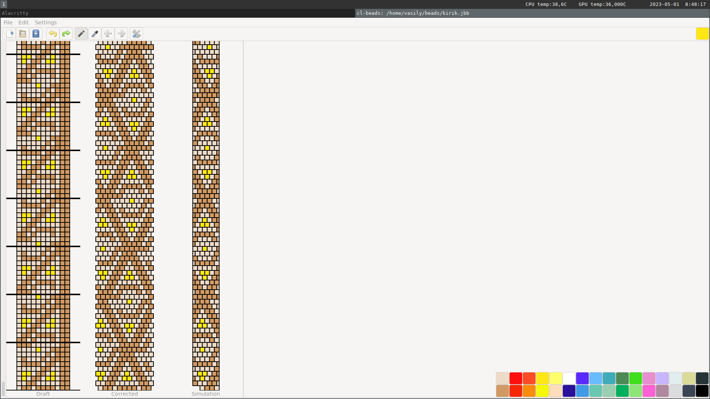
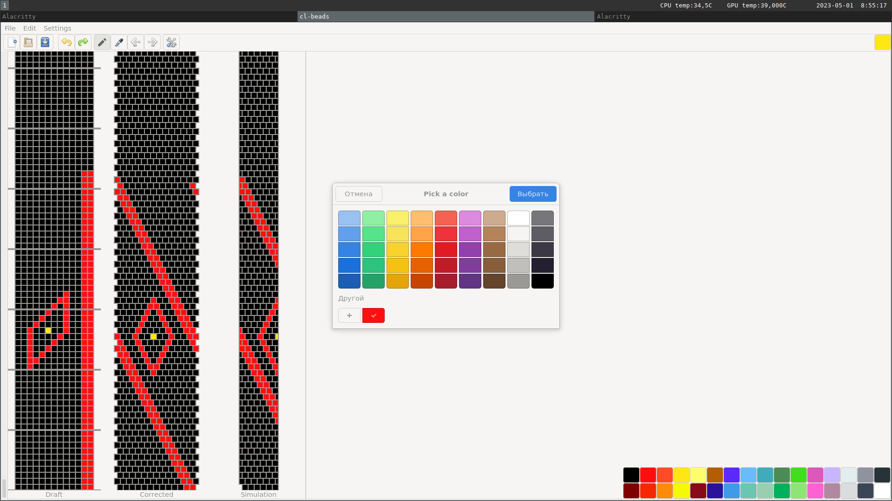
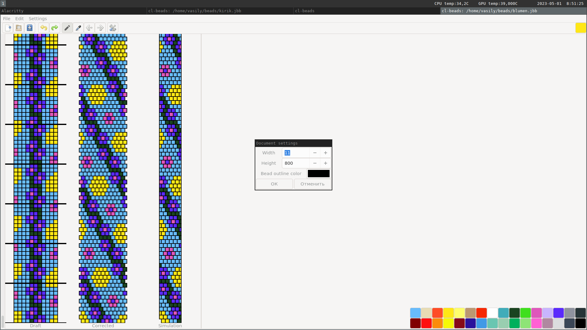

# cl-beads
[](https://github.com/shamazmazum/cl-beads/actions/workflows/build.yml)

## What is it?

**cl-beads** is a program for editing schemes for beaded crochet ropes. It is
portable and uses GTK3 as a UI toolkit. File format used in **cl-beads** is
compatible with JBead program. The purpose of this program is to write a program
which works natively in Wayland environment. Currently it lacks many features
present in JBead (most noticeable, simulation view and report).

## Building

You need some implementation of Common Lisp language (I recommend SBCL) and GTK3
library. Then make sure you have Quicklisp and Ultralisp system repositories and
execute in REPL:

``` lisp
(ql:quickload :cl-beads)
(asdf:make :cl-beads/application)
```

Then run a produced binary.

## Screenshots







## TODO list

* ~~Simulation view~~
* Some report maybe?
* ~~Quit confirmation~~
* Changing color for a range of beads
* Edit history
* ~~Change color for outline of a bead~~
* Add support for DB-Bead format.
